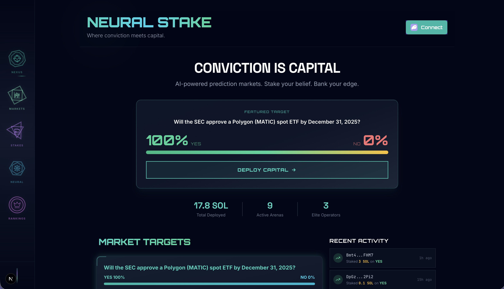
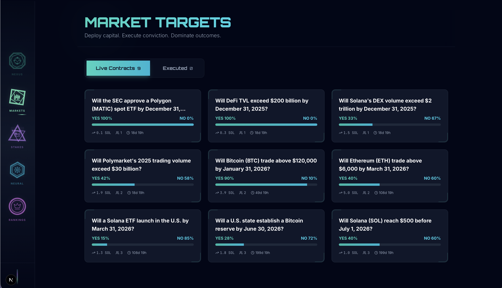
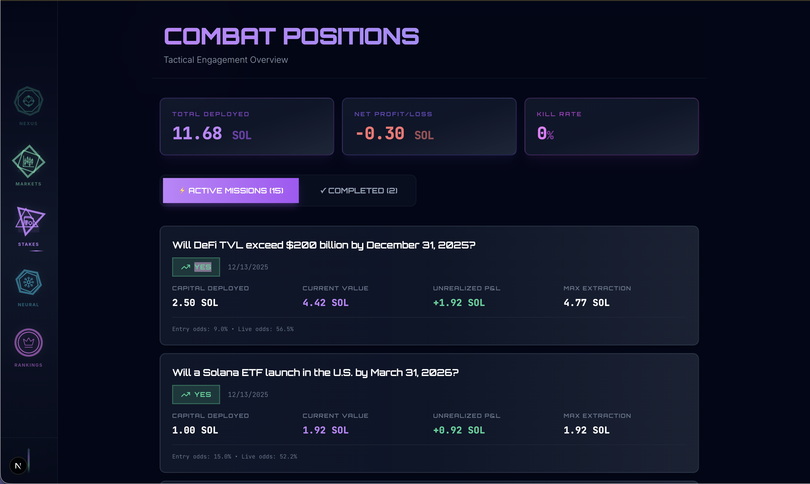
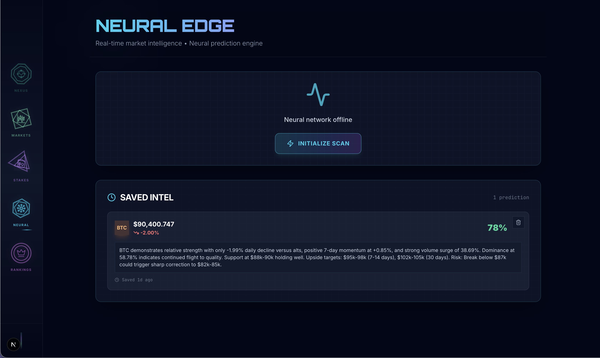

# NEURAL STAKE

> Where conviction meets capital.

**CONVICTION IS CAPITAL**  
AI-powered prediction markets. Stake your belief. Bank your edge.


**🏆 Built for Indie.fun Hackathon | Prediction Markets Track**

Neural Stake is a prediction market platform where you stake SOL on real-world outcomes and let AI do the heavy lifting. Built on Solana for speed, powered by Claude for intelligence. Track your positions live, watch your P&L move in real-time, climb leaderboards, and make calls backed by neural network analysis — not guesswork.

---

## 💻 Theater

- **Live App:** [neural-stake.vercel.app](https://neural-stake.vercel.app)
- **Videos:**
  - [Product Demo (UI Walkthrough)](https://youtu.be/lFu8grnuiL4)
  - [Deep Dive (AI Narrated - 6min)](https://youtu.be/GbFQmryXQTE)
  - [Quick Overview (AI Narrated - 2min)](https://youtu.be/cfZTEPUcQCE)
- **Indie.fun:** [indie.fun/project-7QOD-42LW](https://indie.fun/project-7QOD-42LW)
- **GitHub:** [github.com/intenceheat/Neural-Stake](https://github.com/intenceheat/Neural-Stake)
---

## 📸 Screenshots

### Nexus (Home)

*Featured markets, platform stats, activity feed*

### Markets

*Browse all active/resolved markets*

### Stakes (Positions)

*Track active positions with live P&L, claim resolved payouts*

### Neural Edge

*Real-time AI predictions with confidence scoring*

### Rankings (Leaderboard)

*Global top 20 predictors, win rates, profit tracking*

---

## 🎯 Core Features

### 🏠 **Nexus (Home)**
- Featured prediction market showcase with live odds
- Platform statistics: total volume, active markets, elite operators
- Recent activity feed with real-time updates
- Phantom wallet integration with one-click connect
- Responsive design with teal/cyan theme

### 💼 **Stakes (Positions)**
- **Active positions** tracking with live P&L calculations
- **Resolved positions** with one-click SOL payout claims
- Combat-themed UI with kill rate analytics
- Win rate and profit/loss breakdowns
- Mobile-optimized claim buttons
- Current value vs. potential payout comparison
- Entry odds vs. live odds tracking
- Purple/violet/fuchsia color scheme

### 📊 **Markets**
- Browse all active and resolved prediction markets
- Live/Executed tab system with market counts
- Real-time odds calculation using constant product AMM
- Direct staking interface from market cards
- Time remaining countdown on all markets
- Emerald/green/teal theme

### 🏆 **Rankings (Leaderboard)**
- Global top 20 predictor rankings
- Reputation scores based on prediction accuracy
- Win rate percentages and profit tracking
- Current streak displays with visual indicators
- Total predictions and volume staked per user
- Top 3 podium styling (gold/silver/bronze)
- Activity breakdown: correct vs. incorrect predictions
- Pink/fuchsia/magenta gradient system

### 🧠 **Neural Edge** (AI Intelligence Hub)
- **Real-time AI market predictions** for SOL, BTC, ETH
- **Multi-timeframe technical analysis:**
  - 1-hour, 24-hour, 7-day, 30-day percentage changes
  - Volume data with change percentages
  - Market cap and dominance metrics
- **Volume anomaly detection** (flags whale activity)
- **Confidence scoring system:**
  - 85-100%: Strong confluence + volume confirmation
  - 70-84%: Good momentum with minor conflicts
  - 50-69%: Mixed signals
  - Below 50%: Weak setup
- **Support/resistance level identification**
- **Risk assessment with specific price targets**
- **Downside protection levels**
- **Saved Predictions (Wallet-Gated):**
  - Bookmark any AI prediction with one click
  - Predictions saved per wallet address
  - View your saved predictions history
  - Two-stage delete confirmation (trash → warning → delete)
  - Instant save/delete updates with UI feedback
- **Data persistence** across view switches via React Context
- **Auto-refresh capability** with timestamp display
- Cyan/purple/emerald neural network aesthetic

---

## 🏗️ Architecture

### **Full System Architecture**

```mermaid
graph TB
    subgraph "Frontend Layer"
        A[Next.js Application<br/>React + TypeScript]
        A1[HomeView<br/>Teal Theme]
        A2[PositionsView<br/>Purple Theme]
        A3[MarketsView<br/>Emerald Theme]
        A4[LeaderboardView<br/>Pink Theme]
        A5[Neural Edge<br/>Cyan/Purple Theme]
        A --> A1
        A --> A2
        A --> A3
        A --> A4
        A --> A5
    end

    subgraph "Routing Layer"
        B[Cloudflare Worker<br/>Zone Router]
    end

    subgraph "Automation Engine"
        C[Make.com Scenarios]
        C1[market-pulse<br/>9 modules]
        C --> C1
    end

    subgraph "Data Sources"
        D[CoinMarketCap API<br/>Real-time Prices]
        E[Claude Sonnet 4<br/>AI Predictions]
        F[Supabase<br/>PostgreSQL Database]
    end

    subgraph "Blockchain Layer"
        G[Solana Devnet<br/>Oracle Program]
        H[Phantom Wallet<br/>User Authentication]
    end

    A5 -->|POST zone: market-pulse| B
    B -->|Route request| C1
    C1 -->|Fetch SOL/BTC/ETH| D
    C1 -->|Generate analysis| E
    D -->|Price + Volume data| C1
    E -->|Predictions + Confidence| C1
    C1 -->|Parse + Aggregate| C1
    C1 -->|Formatted JSON| B
    B -->|Response| A5

    A2 -->|Fetch positions| F
    A3 -->|Fetch markets| F
    A4 -->|Fetch leaderboard| F
    
    A2 -->|Claim payout| G
    A3 -->|Create position| G
    H -->|Sign transactions| G
    G -->|Store results| F

    style A fill:#1e293b
    style B fill:#0891b2
    style C fill:#8b5cf6
    style D fill:#f59e0b
    style E fill:#ec4899
    style F fill:#10b981
    style G fill:#3b82f6
    style H fill:#6366f1
    style A5 fill:#06b6d4
```


### **Component Interaction Flow**
```
┌─────────────────────────────────────────────────────────────────────────┐
│                           USER INTERFACE                                 │
│  ┌────────────────┐  ┌──────────────┐  ┌─────────────┐  ┌────────────┐ │
│  │   HomeView     │  │ MarketsView  │  │ StakesView  │  │ Leaderboard│ │
│  │  (Featured)    │  │ (All Markets)│  │ (Positions) │  │  (Rankings)│ │
│  └────────┬───────┘  └──────┬───────┘  └──────┬──────┘  └─────┬──────┘ │
│           │                  │                 │                │        │
│           └──────────────────┴─────────────────┴────────────────┘        │
│                                    │                                     │
└────────────────────────────────────┼─────────────────────────────────────┘
                                     │
                     ┌───────────────┴───────────────┐
                     │                               │
          ┌──────────▼──────────┐        ┌──────────▼──────────┐
          │   WALLET ADAPTER    │        │   SUPABASE CLIENT   │
          │  (Solana Wallets)   │        │   (PostgreSQL)      │
          └──────────┬──────────┘        └──────────┬──────────┘
                     │                              │
          ┌──────────▼──────────┐        ┌──────────▼──────────┐
          │  SOLANA PROGRAM     │        │   DATABASE LAYER    │
          │  (Rust/Anchor)      │        │                     │
          │                     │        │  ┌───────────────┐  │
          │  ┌───────────────┐  │        │  │   Markets     │  │
          │  │  Market PDA   │  │◄───────┼──┤   Positions   │  │
          │  │  Escrow PDA   │  │        │  │   Users       │  │
          │  │  Position PDA │  │        │  └───────┬───────┘  │
          │  └───────────────┘  │        │          │          │
          └─────────────────────┘        │  ┌───────▼───────┐  │
                     │                   │  │   Triggers    │  │
                     │                   │  │ Auto-populate │  │
                     │                   │  │  User Stats   │  │
                     │                   │  └───────────────┘  │
                     │                   └─────────────────────┘
          ┌──────────▼──────────┐
          │   SOLANA DEVNET     │
          │  (Blockchain State) │
          └─────────────────────┘
```

### **Stake Flow (Happy Path)**
```
┌─────────────────────────────────────────────────────────────────────────┐
│                        STAKE FLOW (Happy Path)                           │
└─────────────────────────────────────────────────────────────────────────┘

1. User clicks "Deploy Capital"
   │
   ├──> StakeModal calculates payout using AMM formula:
   │    payout = (total_pool × stake) / (outcome_pool + stake)
   │
2. User confirms in wallet
   │
   ├──> Solana transaction sent to program
   │    ├─> Create Position PDA (user, market, outcome, amount, timestamp)
   │    ├─> Transfer SOL to Escrow PDA
   │    └─> Update Market PDA (increment pool_yes or pool_no)
   │
3. Transaction succeeds
   │
   ├──> Frontend saves position to Supabase
   │    ├─> positions table INSERT
   │    ├─> Trigger: update_user_stats_on_stake fires
   │    │   └─> users table UPSERT (increment total_volume, total_positions)
   │    └─> markets table UPDATE (sync pools from on-chain state)
   │
4. UI updates
   │
   └──> ✅ Position appears in "Stakes" view
        ✅ Odds recalculate on market card
        ✅ Leaderboard updates with new stats
        ✅ Activity feed shows recent stake
```

### **Claim Flow (After Resolution)**
```
┌─────────────────────────────────────────────────────────────────────────┐
│                        CLAIM FLOW (After Resolution)                     │
└─────────────────────────────────────────────────────────────────────────┘

1. Admin resolves market (manual script or automation)
   │
   ├──> Solana program: resolve_market instruction
   │    └─> Market PDA: status = resolved, winning_outcome = YES/NO
   │
2. Supabase: markets table updated (status, winning_outcome)
   │
3. User navigates to "Stakes" → "Resolved" tab
   │
   ├──> PositionsView filters positions WHERE market.status = 'resolved'
   │    └─> Shows "VICTOR" badge + "CLAIM" button for winners
   │
4. User clicks "CLAIM"
   │
   ├──> Solana transaction sent to program
   │    ├─> Verify: market resolved + user is winner
   │    ├─> Calculate payout: (total_pool × user_stake) / winning_pool
   │    ├─> Transfer SOL from Escrow PDA to user wallet
   │    └─> Mark Position PDA as claimed
   │
5. Transaction succeeds
   │
   ├──> Frontend updates Supabase
   │    ├─> positions table UPDATE (claimed = true, payout_amount)
   │    ├─> Trigger: update_user_stats fires
   │    │   └─> users table UPDATE (increment winning_positions, total_profit)
   │    └─> Position shows "✓ EXTRACTED" badge
   │
6. SOL arrives in wallet
   │
   └──> ✅ User sees updated balance
        ✅ Leaderboard reflects new win rate and profit
        ✅ Position marked as claimed
```

### **Neural Edge AI Pipeline**
```
┌─────────────────────────────────────────────────────────────────────────┐
│                   NEURAL EDGE - AI PREDICTION FLOW                       │
└─────────────────────────────────────────────────────────────────────────┘

1. User clicks "ACTIVATE NEURAL SCAN" or auto-refresh triggers
   │
   ├──> Frontend POST to Cloudflare Worker
   │    └─> Body: { zone: "market-pulse" }
   │
2. Cloudflare Worker routes to Make.com
   │
   ├──> Make.com Scenario (9 modules):
   │    │
   │    ├─> Module 1: Webhook Trigger
   │    │   └─> Receives zone=market-pulse
   │    │
   │    ├─> Module 2: Router
   │    │   └─> Filters by zone
   │    │
   │    ├─> Module 3: CoinMarketCap API (HTTP Request)
   │    │   └─> Fetch SOL, BTC, ETH latest quotes
   │    │   └─> Returns: price, volume, market_cap, percent_change_1h/24h/7d/30d
   │    │
   │    ├─> Module 4: Set Variables
   │    │   └─> Extract individual token data into variables
   │    │
   │    ├─> Module 5: Claude AI HTTP Request (Anthropic API)
   │    │   └─> Prompt: Comprehensive market analysis with:
   │    │       - Multi-timeframe trends (1h, 24h, 7d, 30d)
   │    │       - Volume analysis and anomalies
   │    │       - Market cap and dominance
   │    │       - Support/resistance levels
   │    │       - Risk factors
   │    │       - Specific price targets with timeframes
   │    │   └─> Returns: JSON array with predictions for each token
   │    │
   │    ├─> Module 6: Parse JSON
   │    │   └─> Extract: token, prediction, confidence
   │    │
   │    ├─> Module 7: Create JSON (Iterator - runs 3x)
   │    │   └─> Combine CoinMarketCap data + AI predictions
   │    │   └─> Output: { token, price, change24h, prediction, confidence, timestamp }
   │    │
   │    ├─> Module 8: Array Aggregator
   │    │   └─> Group by: "market-pulse" (static value)
   │    │   └─> Forces all 3 bundles into single array
   │    │   └─> Output: [{ json: "{SOL}" }, { json: "{BTC}" }, { json: "{ETH}" }]
   │    │
   │    └─> Module 9: Webhook Response
   │        └─> Status: 200
   │        └─> Body: Aggregated array
   │
3. Response returns to Frontend
   │
   ├──> Parse nested JSON strings
   │    └─> data.map(item => JSON.parse(item.json))
   │
   ├──> Store in NeuralContext (React Context)
   │    └─> Persists across view switches
   │
   └──> Render 3 market cards:
        ├─> SOL: Price, 24h change, AI prediction, confidence bar
        ├─> BTC: Price, 24h change, AI prediction, confidence bar
        └─> ETH: Price, 24h change, AI prediction, confidence bar

4. User switches to Markets view, then back to Neural Edge
   │
   └──> Data still present (no re-fetch required)
        └─> User can manually refresh via button
```

---

## 🛠️ Tech Stack

### **Frontend**
- **Next.js 16** - React framework with App Router
- **TypeScript** - Type safety and developer experience
- **Tailwind CSS** - Utility-first styling with custom design system
- **Framer Motion** - Smooth animations and transitions
- **Lucide React** - Consistent icon system
- **Solana Wallet Adapter** - Multi-wallet support (Phantom, Solflare, etc.)

### **Blockchain**
- **Solana Web3.js** - Blockchain interaction library
- **Anchor Framework** - Smart contract development and deployment
- **Program ID:** `BhCVTNcTnrzRxZSayuX3kYBJZ36mUk5VB7C7k6uuhpDj`
- **Network:** Devnet (mainnet deployment planned)

### **Backend & Automation**
- **Cloudflare Workers** - Serverless edge routing layer
- **Make.com** - No-code workflow automation (9-module scenario)
- **Supabase** - PostgreSQL database with real-time subscriptions
- **Database Triggers** - Auto-populate user stats on stake/claim

### **AI & Data**
- **Claude Sonnet 4** - Advanced market analysis and predictions
- **Anthropic API** - Direct integration for neural predictions
- **CoinMarketCap API** - Real-time crypto market data (prices, volume, market cap)

### **State Management**
- **React Context API** - Global state for Neural Edge persistence
- **React Hooks** - Local component state management

---

## 🎨 Design System

### **Color-Coded Navigation**

Each view has a unique color scheme that matches its navigation glyph, creating visual cohesion across the platform:

| View | Glyph | waterColor | Header Gradient | Theme |
|------|-------|------------|-----------------|-------|
| **Nexus (Home)** | Hexagon | `#0f766e` | `from-teal-400 via-cyan-400 to-emerald-400` | Teal/Cyan |
| **Stakes (Positions)** | Star Vault | `#c084fc` | `from-purple-400 via-violet-400 to-fuchsia-400` | Purple/Violet |
| **Markets** | Candlestick | `#6ee7b7` | `from-emerald-400 via-green-400 to-teal-400` | Emerald/Green |
| **Rankings (Leaderboard)** | Crown | `#e879f9` | `from-fuchsia-400 via-pink-400 to-rose-400` | Pink/Fuchsia |
| **Neural Edge** | Neural Net | `#06b6d4` | `from-cyan-400 via-purple-400 to-emerald-400` | Cyan/Purple |

### **UI Principles**
- **Sticky headers** with backdrop blur on all views
- **Glass morphism effects** (`bg-slate-900/60 backdrop-blur-xl`)
- **Invisible scrollbars** with no bounce (`overscroll-behavior-y: none`)
- **Mobile-first responsive design** with breakpoint-specific styling
- **Smooth slide-in animations** (`x: -50 → 0` with staggered delays)
- **Orbitron typography** for headers (tactical/operator aesthetic)
- **Monospace fonts** for numbers and data displays
- **Consistent border system** (`border-slate-800/50` with hover states)

### **Animation Strategy**
- **Entrance animations:** Staggered with `delay: index * 0.05`
- **Transitions:** `ease: "easeOut"` for natural feel
- **Hover effects:** Subtle scale transforms (`hover:scale-[1.02]`)
- **Loading states:** Rotating spinners with color-matched borders

---

## 🚀 Quick Start

### **Prerequisites**
- Node.js 18+
- Solana CLI (for local program development)
- Phantom or Solflare wallet extension

### **Installation**
```bash
# Clone repository
git clone https://github.com/intenceheat/neural-stake.git
cd neural-stake

# Install dependencies
npm install --legacy-peer-deps

# Set up environment variables
cp .env.example .env.local
```

### **Environment Setup**

Create `.env.local`:
```bash
# Supabase
NEXT_PUBLIC_SUPABASE_URL=your_supabase_url
NEXT_PUBLIC_SUPABASE_ANON_KEY=your_supabase_anon_key

# Solana
NEXT_PUBLIC_SOLANA_RPC_URL=https://api.devnet.solana.com
NEXT_PUBLIC_PROGRAM_ID=BhCVTNcTnrzRxZSayuX3kYBJZ36mUk5VB7C7k6uuhpDj

# Cloudflare Worker (Neural Edge)
NEXT_PUBLIC_CLOUDFLARE_WEBHOOK_URL=your_worker_url
```

### **Run Development Server**
```bash
npm run dev
```

Open [http://localhost:3000](http://localhost:3000)

---

## 📊 Database Schema

### **Markets Table**
```sql
CREATE TABLE markets (
  id UUID PRIMARY KEY DEFAULT uuid_generate_v4(),
  market_id TEXT UNIQUE NOT NULL,
  question TEXT NOT NULL,
  description TEXT,
  end_time TIMESTAMPTZ NOT NULL,
  resolved_at TIMESTAMPTZ,
  status TEXT DEFAULT 'active', -- active | resolved | cancelled
  pool_yes NUMERIC DEFAULT 0,
  pool_no NUMERIC DEFAULT 0,
  total_volume NUMERIC GENERATED ALWAYS AS (pool_yes + pool_no) STORED,
  participant_count INTEGER DEFAULT 0,
  winning_outcome TEXT, -- YES | NO | null
  sentiment_score NUMERIC CHECK (sentiment_score BETWEEN 0 AND 1),
  sentiment_confidence INTEGER CHECK (sentiment_confidence BETWEEN 0 AND 100),
  created_at TIMESTAMPTZ DEFAULT NOW(),
  updated_at TIMESTAMPTZ DEFAULT NOW()
);
```

### **Positions Table**
```sql
CREATE TABLE positions (
  id UUID PRIMARY KEY DEFAULT uuid_generate_v4(),
  market_id TEXT NOT NULL REFERENCES markets(market_id),
  user_wallet TEXT NOT NULL,
  outcome TEXT NOT NULL, -- yes | no
  stake_amount NUMERIC NOT NULL,
  odds_at_stake NUMERIC NOT NULL,
  potential_payout NUMERIC NOT NULL,
  claimed BOOLEAN DEFAULT FALSE,
  payout_amount NUMERIC DEFAULT 0,
  onchain_timestamp BIGINT NOT NULL,
  created_at TIMESTAMPTZ DEFAULT NOW(),
  updated_at TIMESTAMPTZ DEFAULT NOW()
);

CREATE INDEX idx_positions_user_wallet ON positions(user_wallet);
CREATE INDEX idx_positions_market_id ON positions(market_id);
CREATE INDEX idx_positions_claimed ON positions(claimed);
```

### **Users Table**
```sql
CREATE TABLE users (
  wallet_address TEXT PRIMARY KEY,
  reputation_score NUMERIC DEFAULT 1000,
  total_volume NUMERIC DEFAULT 0,
  total_positions INTEGER DEFAULT 0,
  winning_positions INTEGER DEFAULT 0,
  losing_positions INTEGER DEFAULT 0,
  win_rate NUMERIC GENERATED ALWAYS AS (
    CASE 
      WHEN total_positions = 0 THEN 0 
      ELSE (winning_positions::NUMERIC / total_positions) * 100 
    END
  ) STORED,
  total_profit NUMERIC DEFAULT 0,
  created_at TIMESTAMPTZ DEFAULT NOW(),
  updated_at TIMESTAMPTZ DEFAULT NOW()
);
```

### **Database Triggers**

**Auto-update user stats on stake:**
```sql
CREATE OR REPLACE FUNCTION update_user_stats_on_stake()
RETURNS TRIGGER AS $$
BEGIN
  INSERT INTO users (wallet_address, total_volume, total_positions)
  VALUES (NEW.user_wallet, NEW.stake_amount, 1)
  ON CONFLICT (wallet_address) DO UPDATE
  SET 
    total_volume = users.total_volume + NEW.stake_amount,
    total_positions = users.total_positions + 1,
    updated_at = NOW();
  RETURN NEW;
END;
$$ LANGUAGE plpgsql;

CREATE TRIGGER trigger_update_user_stats_on_stake
AFTER INSERT ON positions
FOR EACH ROW
EXECUTE FUNCTION update_user_stats_on_stake();
```

**Auto-update user stats on claim:**
```sql
CREATE OR REPLACE FUNCTION update_user_stats()
RETURNS TRIGGER AS $$
BEGIN
  IF NEW.claimed = TRUE AND OLD.claimed = FALSE THEN
    UPDATE users
    SET 
      winning_positions = winning_positions + 1,
      total_profit = total_profit + (NEW.payout_amount - NEW.stake_amount),
      updated_at = NOW()
    WHERE wallet_address = NEW.user_wallet;
  END IF;
  RETURN NEW;
END;
$$ LANGUAGE plpgsql;

CREATE TRIGGER trigger_update_user_stats
AFTER UPDATE ON positions
FOR EACH ROW
EXECUTE FUNCTION update_user_stats();
```

---

## 🧩 PDA (Program Derived Address) Structure

### **Market PDA**
```rust
#[account]
pub struct Market {
    pub market_id: String,        // Unique identifier
    pub question: String,          // Max 256 chars
    pub end_time: i64,            // Unix timestamp
    pub status: MarketStatus,      // Active | Resolved | Cancelled
    pub pool_yes: u64,            // Lamports staked on YES
    pub pool_no: u64,             // Lamports staked on NO
    pub winning_outcome: Option<Outcome>, // Some(YES/NO) or None
    pub creator: Pubkey,          // Market creator wallet
}

// Seeds: ["market", market_id]
```

### **Escrow PDA**
```rust
// System account that holds all staked SOL for a market
// Seeds: ["market_escrow", market_pda]
// Authority: Oracle program
```

### **Position PDA**
```rust
#[account]
pub struct Position {
    pub user: Pubkey,             // User wallet
    pub market: Pubkey,           // Market PDA
    pub outcome: Outcome,         // YES | NO
    pub amount: u64,              // Lamports staked
    pub timestamp: i64,           // Unix timestamp
    pub claimed: bool,            // Has payout been claimed?
}

// Seeds: ["position", user_wallet, market_id, timestamp]
```

---

## 🎮 Usage Guide

### **1. Connect Wallet**
Click "Connect" in the top-right corner and approve the connection in your Solana wallet.

### **2. Browse Markets**
- View featured market on homepage
- Navigate to Markets view for all active/resolved markets
- Check AI sentiment scores (green = bullish, red = bearish)
- See current odds, time remaining, and participant counts

### **3. Place a Stake**
1. Click "Deploy Capital" on any market
2. Select YES or NO outcome
3. Enter stake amount (0.1+ SOL recommended)
4. Review potential payout and ROI calculation
5. Confirm transaction in wallet
6. Wait for on-chain confirmation (~400ms on Solana)

### **4. Track Positions**
- Navigate to "Stakes" view
- See all active positions with:
  - Current value (live calculation)
  - Unrealized P&L
  - Entry odds vs. current odds
  - Maximum potential payout
- Switch to "Resolved" tab to see completed positions

### **5. Claim Winnings**
- After market resolves, winning positions show "VICTOR" badge
- Click "CLAIM" button to execute on-chain claim
- SOL is transferred directly from escrow PDA to your wallet
- Position updates to "✓ EXTRACTED" status
- Leaderboard reflects new win rate and profit

### **6. Neural Edge Intelligence**
- Navigate to Neural Edge view
- Click "Initialize SCAN" for fresh predictions
- View AI analysis for SOL, BTC, ETH with:
  - Current price and 24h change
  - Neural confidence percentage (color-coded)
  - Detailed technical analysis
  - Support/resistance levels
  - Risk factors
- Bookmark predictions for later reference (wallet required)
- Data persists when switching views
- Manual refresh available via refresh button

---

## ❓ FAQ

**Q: Where is my SOL stored after staking?**
A: In program-controlled escrow PDAs. You maintain full custody via your wallet's signing authority. Only the program can move funds according to predetermined rules.

**Q: What happens if a market never resolves?**
A: Refund mechanism planned for v2. Currently requires manual admin intervention to cancel and return funds proportionally.

**Q: Can I cancel a stake after placing it?**
A: No. Stakes are final once confirmed on-chain. This ensures market integrity and prevents manipulation.

**Q: How are odds calculated?**
A: Using constant product AMM formula:
```
payout = (total_pool × your_stake) / (outcome_pool + your_stake)
```
This creates dynamic odds that adjust based on pool imbalance.

**Q: What's the fee structure?**
A: Currently 0% fees on devnet for testing. Mainnet will likely implement a small protocol fee (1-2%) for sustainability.

**Q: Is the smart contract code audited?**
A: Not yet. Currently in devnet testing phase. Full professional audit planned before mainnet deployment.

**Q: Can I create my own markets?**
A: AI-powered market creation via Claude API is in development. Manual creation currently requires admin access. Community-created markets planned for future versions.

**Q: What wallets are supported?**
A: Any Solana wallet via Wallet Adapter:
- Phantom (recommended)
- Solflare
- Backpack
- Glow
- Brave Wallet
- And 20+ more

**Q: How does the AI sentiment analysis work?**
A: Claude Sonnet 4 analyzes:
- Multi-timeframe price trends (1h, 24h, 7d, 30d)
- Volume patterns and anomalies
- Market cap and dominance shifts
- Support/resistance levels from technical analysis
- News sentiment (future integration)
Returns confidence-scored predictions with specific targets.

**Q: What happens if I win but the market creator disagrees?**
A: Market resolution is immutable once executed on-chain. Dispute mechanisms and decentralized oracle integrations planned for v2 to ensure fair resolution.

**Q: Can I stake on multiple outcomes in the same market?**
A: Yes, but it's capital-inefficient (you'd need to stake more than total pool to guarantee profit). Better to choose one side with conviction.

---

## ⚠️ Known Limitations

### **Current Version (Devnet)**
- ⚠️ Markets must be manually resolved (automation in progress via Chainlink/Pyth oracle integration)
- ⚠️ Devnet only (mainnet deployment post-audit)
- ⚠️ Max 20 concurrent markets for performance optimization
- ⚠️ Neural Edge predictions are not financial advice (entertainment/educational purposes)
- ⚠️ Mobile wallet experience varies by provider (Phantom Mobile recommended)

### **Browser Support**
| Browser | Status | Notes |
|---------|--------|-------|
| Chrome/Brave | ✅ Full support | Recommended |
| Firefox | ✅ Full support | Works well |
| Safari | ⚠️ Partial | Wallet adapter issues (upstream bug) |
| Mobile | ⚠️ Varies | Use Phantom Mobile for best experience |

### **Performance Considerations**
- High-traffic markets may experience brief (1-2s) sync delays between blockchain and database
- Leaderboard refreshes every 10 seconds via polling (real-time subscriptions planned)
- Activity feed uses Supabase real-time for instant updates
- Neural Edge API calls limited to prevent rate limiting (30 requests/hour per IP)

---

## 🔐 Security

### **On-Chain Security**
- ✅ All funds held in program-controlled escrow PDAs
- ✅ No admin keys or centralized control over user funds
- ✅ Deterministic PDA generation prevents address spoofing
- ✅ Source code available for community audit
- ⚠️ Professional audit pending (mainnet blocker)

### **Wallet Safety**
- ✅ Only transaction signing is requested (never seed phrases)
- ✅ All stakes are non-custodial
- ✅ Users retain full control of assets at all times
- ✅ Clear transaction previews before signing

### **Data Integrity**
- ✅ Positions recorded both on-chain (source of truth) and in database (indexer)
- ✅ Database acts as read-optimized mirror, not authoritative state
- ✅ Blockchain data is always authoritative in case of conflicts
- ✅ Database triggers ensure stats consistency

### **API Security (Neural Edge)**
- ✅ Cloudflare Worker rate limiting (100 req/hour per IP)
- ✅ Zone-based routing prevents unauthorized access
- ✅ No sensitive keys exposed to frontend
- ✅ CORS properly configured for security

---

## 🛠️ Development

### **Project Structure**
```
neural-stake/
├── app/                        # Next.js App Router
│   ├── page.tsx               # Main navigation container
│   ├── layout.tsx             # Root layout with providers
│   └── globals.css            # Global styles + Tailwind
├── components/
│   ├── oracle/                # Market-specific components
│   │   ├── MarketCard.tsx     # Individual market display
│   │   ├── StakeModal.tsx     # Staking interface with AMM calc
│   │   ├── OddsTicker.tsx     # Live odds visualization
│   │   └── ActivityFeed.tsx   # Recent activity feed
│   ├── views/                 # Full-page views
│   │   ├── HomeView.tsx       # Landing page
│   │   ├── PositionsView.tsx  # User positions tracking
│   │   ├── MarketsView.tsx    # All markets browse
│   │   ├── LeaderboardView.tsx # Rankings
│   │   ├── OperationsView.tsx # Neural Edge container
│   │   └── intel/             # Neural Edge subcomponents
│   │       └── LiveMarketPulse.tsx
│   ├── navigation/            # Nav system
│   │   ├── NavigationProvider.tsx
│   │   ├── NavigationSidebar.tsx (desktop)
│   │   ├── NavigationDrawer.tsx (mobile)
│   │   ├── NavigationGlyph.tsx
│   │   └── CustomGlyphIcons.tsx
│   └── wallet/
│       └── WalletButton.tsx   # Wallet connection UI
├── contexts/
│   └── NeuralContext.tsx      # Global state for Neural Edge
├── lib/
│   ├── solana/
│   │   ├── oracle-program.ts  # On-chain interactions
│   │   └── types.ts           # Program types
│   └── supabase.ts            # Database client + services
├── programs/                   # Rust/Anchor (separate repo)
├── public/                     # Static assets
└── scripts/                    # Utility scripts
    └── init-markets.ts        # Market seeding
```

### **Key Files Deep Dive**

**`lib/solana/oracle-program.ts`**
- Anchor program initialization
- Wallet provider setup
- Transaction building for stake/claim
- PDA derivation helpers
- Error handling for on-chain calls

**`components/oracle/StakeModal.tsx`**
- AMM payout calculation
- Input validation and error states
- Transaction signing flow
- Success/failure toast notifications
- Real-time odds updates

**`components/views/PositionsView.tsx`**
- Active/Resolved tab system
- Live P&L calculations
- One-click claim functionality
- Mobile-optimized layouts
- Win rate and profit analytics

**`lib/supabase.ts`**
- Type-safe database queries
- Service layer pattern (marketService, positionService, userService)
- Real-time subscription setup
- Error handling and retries

**`contexts/NeuralContext.tsx`**
- React Context for global state
- Persistent market data across views
- Fetch function for API calls
- Loading states and error handling

---

## 🤝 Contributing

Priority areas:

### **High Priority**
- [ ] Automated market resolution via Chainlink/Pyth oracles
- [ ] Mobile app (React Native + Solana Mobile SDK)
- [ ] Additional AI models for sentiment (GPT-4, Gemini)
- [ ] Mainnet deployment + audit coordination

### **Medium Priority**
- [ ] Additional market types (sports, politics, tech launches)
- [ ] Liquidity mining incentives
- [ ] Community-created markets with moderation
- [ ] Advanced charting for Neural Edge

### **Low Priority**
- [ ] Dark/light theme toggle
- [ ] Multi-language support (i18n)
- [ ] Social features (comments, reactions)
- [ ] NFT rewards for top predictors

**To contribute:**
1. Fork the repository
2. Create a feature branch (`git checkout -b feature/amazing-feature`)
3. Commit changes (`git commit -m 'feat: Add amazing feature'`)
4. Push to branch (`git push origin feature/amazing-feature`)
5. Open a Pull Request with detailed description

**Code style:**
- TypeScript strict mode enabled
- Tailwind for all styling (no CSS modules)
- Framer Motion for animations
- ESLint + Prettier configured

---

## 📈 Roadmap

### **Phase 1: Core Platform** ✅ (COMPLETE)
- [x] Solana program deployment (Anchor framework)
- [x] Basic market creation and staking
- [x] Position tracking with live P&L
- [x] One-click claim flow
- [x] Leaderboard and user stats
- [x] 5-view navigation system
- [x] Color-coded design system
- [x] Mobile-responsive UI

### **Phase 2: AI Integration** 🚧 (IN PROGRESS)
- [x] Neural Edge view with real-time predictions
- [x] Claude Sonnet 4 integration via Make.com
- [x] Multi-timeframe technical analysis
- [x] Confidence scoring system
- [ ] Live AI market creation via Claude API
- [ ] Dynamic sentiment updates (every 15 minutes)
- [ ] Natural language market queries
- [ ] Predictive analytics dashboard

### **Phase 3: Decentralization**
- [ ] Chainlink/Pyth oracle integration for auto-resolution
- [ ] Community governance via $NEURAL token
- [ ] Decentralized market creation (permissionless)
- [ ] Dispute resolution mechanism
- [ ] Multi-signature admin controls

### **Phase 4: Ecosystem Growth**
- [ ] Mainnet deployment
- [ ] Professional security audit (Neodyme/OtterSec)
- [ ] Token launch ($NEURAL) with fair distribution
- [ ] Mobile app (iOS + Android)
- [ ] Liquidity mining program
- [ ] Trading API for bots/algos
- [ ] Partner integrations (DeFi protocols, data providers)

### **Phase 5: Scale**
- [ ] Cross-chain expansion (Ethereum L2s, Base, Arbitrum)
- [ ] Advanced order types (limit orders, stop-loss)
- [ ] Institutional tools (API, webhooks, analytics)
- [ ] White-label solution for partners
- [ ] Educational content and certification program

---

## 🏆 Hackathon Submission

### **Indie.fun Hackathon Criteria**

**Product Quality & Execution** ⭐⭐⭐⭐⭐
- 5 fully operational views with production-grade UI
- Real AI integration (not mocked data)
- On-chain smart contract deployed and functional
- Mobile-first responsive design
- Zero placeholder content

**Technical Implementation** ⭐⭐⭐⭐⭐
- Full-stack Solana integration with Anchor
- AI-powered predictions via Claude Sonnet 4
- Automated data pipeline with Make.com (9 modules)
- Real-time database with triggers
- Edge computing with Cloudflare Workers
- React Context for state persistence

**Originality & Concept** ⭐⭐⭐⭐⭐
- First prediction market with integrated AI intelligence layer
- Neural confidence scoring system (85-100% strong signals)
- Multi-timeframe technical analysis (1h/24h/7d/30d)
- Risk assessment with specific price targets
- Color-coded navigation matching view themes

**User Experience & Design** ⭐⭐⭐⭐⭐
- Intuitive 5-view navigation system
- One-click wallet connection
- Real-time P&L tracking
- Glass morphism aesthetic
- Smooth animations and transitions
- Mobile-optimized buttons and layouts

**Vision & Narrative** ⭐⭐⭐⭐⭐
- Democratizes prediction markets with AI assistance
- Solana's speed enables instant settlement
- Transparent on-chain execution builds trust
- Future: Community governance, token launch, cross-chain expansion

---

## 📄 License

MIT License - see [LICENSE](LICENSE) for details

---

## 🔗 Links

- **GitHub:** [github.com/intenceheat/neural-stake](https://github.com/intenceheat/neural-stake)
- **Video Theatre:** https://youtu.be/lFu8grnuiL4
- **Indie.fun:** https://indie.fun/project-7QOD-42LW

---

## 💬 Support

- **Issues:** [GitHub Issues](https://github.com/intenceheat/neural-stake/issues)
- **Discussions:** [GitHub Discussions](https://github.com/intenceheat/neural-stake/discussions)

---

## 🙏 Acknowledgments

Built for the Indie.fun Hackathon and the Solana prediction market community.

**Special thanks to:**
- **Solana Foundation** for developer tooling and RPC infrastructure
- **Anchor Framework** for smart contract development framework
- **Supabase** for backend infrastructure and real-time database
- **Claude AI (Anthropic)** for market analysis capabilities
- **Make.com** for workflow automation platform
- **Cloudflare** for edge computing and routing
- **CoinMarketCap** for crypto market data API

**Judges & Partners:**
- Play Solana
- Moddio
- Indie.fun
- Solana Gaming
- icm.run
- Addicteddotfun

---

**CONVICTION IS CAPITAL. STAKE YOUR EDGE.** 🎯

**Solo runner. Zero theater. Built with precision.**

**Made for Indie.fun Hackathon | December 2025**